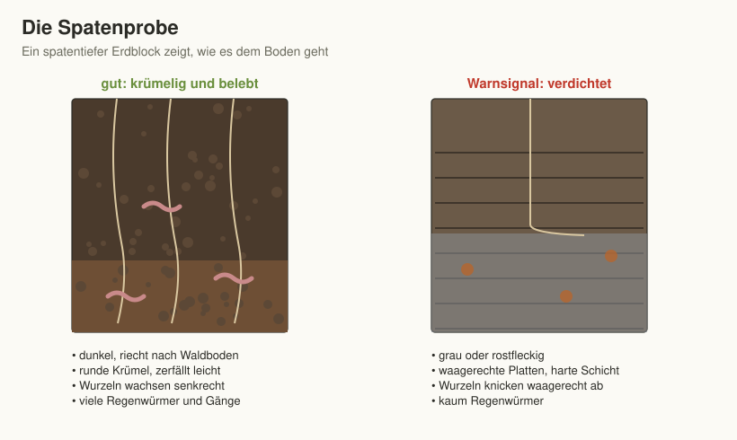

# Kapitel 3 – Der Boden – das Fundament

Wer Gemüse erntet, erntet in Wahrheit Boden. Alles, was oben wächst, beginnt
unten: Ein lebendiger, humusreicher Boden speichert Wasser, liefert
Nährstoffe, hält Wurzeln gesund – und verzeiht Pflegefehler. Kein Kapitel
dieses Buches zahlt sich stärker aus als dieses.

Die gute Nachricht vorweg: Sie müssen Ihren Boden nicht austauschen und
kein Chemiestudium absolvieren. Sie müssen ihn kennen lernen – mit den
Händen, dem Spaten und etwas Aufmerksamkeit – und ihn dann Jahr für Jahr
mit organischem Material füttern. Den Rest erledigt das Bodenleben.

## Woraus Boden besteht

Ein guter Gartenboden ist ungefähr zur Hälfte fest und zur Hälfte Hohlraum:

- **rund 45 % Mineralteilchen** – Sand, Schluff und Ton, das verwitterte
  Ausgangsgestein;
- **rund 5 % organische Substanz** – Humus, Wurzeln, Bodenlebewesen;
- **rund 50 % Poren**, gefüllt mit Luft und Wasser, im Idealfall etwa zu
  gleichen Teilen.

Diese Poren sind der Schlüssel. In den großen Poren zirkuliert Luft, in
den feinen hält sich Wasser, das die Wurzeln aufnehmen können. Ein
verdichteter Boden hat kaum große Poren – er erstickt bei Nässe und wird
bei Trockenheit hart. Ein reiner Sandboden hat kaum feine Poren – das
Wasser rauscht durch. Humus und Bodenleben schaffen die **Krümelstruktur**,
in der beides nebeneinander existiert.

Unter der Oberfläche liegen Schichten: der dunkle, humusreiche
**Oberboden** (im Garten oft 20–40 cm), darunter der hellere, humusarme
**Unterboden**. Fast alle Gemüsewurzeln arbeiten im Oberboden. Ihn zu
pflegen und zu vertiefen ist die eigentliche Arbeit des Gärtners.

## Welchen Boden haben Sie? Die Fingerprobe

Nehmen Sie eine Handvoll feuchte Erde aus 10–20 cm Tiefe und versuchen Sie,
sie zwischen den Handflächen zu einer Wurst zu rollen:

- **Zerfällt sofort, fühlt sich körnig an: Sandboden.** Leicht zu
  bearbeiten, erwärmt sich früh, aber Wasser und Nährstoffe rauschen durch.
- **Fühlt sich mehlig-samtig an, haftet in den Fingerrillen, lässt sich
  schlecht rollen: Schluffboden** (etwa Löss). Fruchtbar und gut
  bearbeitbar, neigt aber zum Verschlämmen und Verkrusten.
- **Lässt sich rollen, klebt aber kaum: Lehmboden.** Der Glücksfall –
  speichert gut und bleibt bearbeitbar.
- **Lässt sich dünn rollen, glänzt beim Reiben, klebt: Tonboden.**
  Nährstoffreich, aber schwer, kalt und staunass.

In der Praxis sind die meisten Gartenböden Mischungen – „lehmiger Sand"
oder „sandiger Lehm". Was zählt, ist die Tendenz:

| Bodenart | Erwärmung | Wasser | Nährstoffe | Bearbeitung | Pflege |
|----------|-----------|--------|------------|-------------|--------|
| Sand | früh, schnell | hält schlecht | hält schlecht | leicht, jederzeit | Humus, Humus, Humus: jährlich Kompost, ständig mulchen, Gründüngung |
| Schluff | mittel | gut | gut | leicht, verschlämmt | Bodenbedeckung gegen Verkrustung, nie nackt lassen |
| Lehm | mittel | gut | gut | gut | Kompost zur Erhaltung, sonst wenig |
| Ton | spät, langsam | hält zu viel, staunass | sehr gut | schwer, nur bei richtiger Feuchte | grober Kompost, tiefwurzelnde Gründüngung, Hochbeete, nie nass bearbeiten |

**Was wächst wo besonders gut?** Möhren, Pastinaken und Zwiebeln lieben
leichte, sandige Böden; Kohl, Lauch und Sellerie schwere, nährstoffreiche.
Kartoffeln gedeihen fast überall, lockern Tonböden aber besonders wirksam.
Auf Ton helfen bei Wurzelgemüse kurze, runde Sorten.

### Die Schlämmprobe im Glas

Wer es genauer wissen will: Ein Schraubglas zu einem Drittel mit Erde
füllen, fast bis oben mit Wasser auffüllen, kräftig schütteln und stehen
lassen. Nach einer Minute hat sich der Sand unten abgesetzt, nach
einigen Stunden der Schluff darüber, nach ein, zwei Tagen der Ton ganz
oben; Humusteilchen schwimmen. Die Dicke der Schichten zeigt die
Anteile – ein anschaulicher Test, der auch Kindern Spaß macht.

## Die Spatenprobe: dem Boden unter die Haut schauen

Die Fingerprobe verrät die Bodenart, die **Spatenprobe** den Zustand. Am
besten im Frühjahr oder Herbst, wenn der Boden feucht, aber nicht nass
ist:

1. Stechen Sie auf drei Seiten einen spatentiefen Block ab, ohne ihn
   herauszuhebeln.
2. Graben Sie auf der vierten Seite ein Loch daneben, damit Sie den Block
   von der Seite ansehen können.
3. Hebeln Sie ihn vorsichtig heraus, legen Sie ihn auf ein Brett und
   brechen Sie ihn mit den Händen auf.

| Worauf achten? | Gutes Zeichen | Warnsignal |
|----------------|---------------|------------|
| Geruch | frisch, nach Waldboden | faulig, muffig, säuerlich |
| Farbe | dunkel, gleichmäßig bis in 20–30 cm | graue, blaugraue oder rostfleckige Zonen (Staunässe) |
| Struktur | krümelig, zerfällt in kleine runde Aggregate | große, scharfkantige Klumpen, waagerechte Platten |
| Wurzeln | wachsen senkrecht und verzweigt in die Tiefe | knicken waagerecht ab (Verdichtung) |
| Regenwürmer | mehrere pro Spatenstich, viele Gänge | keine oder kaum Würmer |
| Pflanzenreste | zu Humus umgebaut | unverrottete Reste vom Vorjahr (Luftmangel) |

*Abbildung 3.1: Die Spatenprobe – gesunder und verdichteter Boden im Vergleich.*

**Zehn Regenwürmer pro Spatenstich** sind ein gutes Zeugnis. Findet sich
in 20–30 cm Tiefe eine harte, waagerechte Schicht (eine „Pflugsohle" oder
Bauverdichtung), muss sie einmalig aufgebrochen werden – mehr dazu unter
„Problemböden".

## Der pH-Wert

Der pH-Wert beschreibt, wie sauer oder basisch (kalkhaltig) ein Boden
ist. Er entscheidet, ob Nährstoffe für die Pflanzen verfügbar sind: Im
sehr sauren Boden werden Phosphor und Molybdän knapp, im stark kalkhaltigen
Eisen und Mangan. Die meisten Gemüse mögen es **leicht sauer bis neutral
(pH 6–7)**.

**Messen** lässt sich der pH-Wert mit Teststreifen oder einem Bodentest
aus dem Gartenhandel – ausreichend genau für den Hausgebrauch. Mehrere
Stellen prüfen, Erde mit destilliertem Wasser anrühren.

| pH-Wert | Einordnung | Kulturen, die das mögen |
|---------|------------|-------------------------|
| 4,0–5,0 | stark sauer | Heidelbeeren, Preiselbeeren (Moorbeet) |
| 5,5–6,5 | leicht sauer | Kartoffeln, Himbeeren, Erdbeeren, Kürbis, Tomaten |
| 6,0–7,0 | schwach sauer bis neutral | die meisten Gemüse und Kräuter |
| 6,5–7,5 | neutral bis leicht basisch | Kohl (pH über 7 hemmt die Kohlhernie), Spinat, Rote Bete, Sellerie, Lauch, mediterrane Kräuter |

Sandböden sollten eher bei 5,5–6,5 liegen, Lehm- und Tonböden bei
6,5–7,0.

**Kalken** ist nur nötig, wenn der Wert nachweislich zu niedrig ist.
Bewährt sind kohlensaurer Kalk oder Algenkalk in Gaben von etwa
100–200 g pro m², im Herbst ausgestreut und flach eingeharkt; auf Sand
eher weniger, auf Ton eher mehr. Nie gleichzeitig mit Mist oder frischem
Kompost ausbringen und nie „vorsorglich" – ein zu hoher pH-Wert lässt sich
viel schwerer korrigieren als ein zu niedriger. Über pH 7,5 helfen
saurer Laubkompost, Nadelstreu unter Beeren und Geduld.

Alle drei bis fünf Jahre eine **Bodenprobe ins Labor** zu schicken
(Nährstoffe und pH, kostet wenig, Anleitung in Kapitel 10) ersetzt jedes
Rätselraten – überdüngte Gärten sind häufiger als unterversorgte.

## Was die Beikräuter verraten

Auch die **Zeigerpflanzen** erzählen vom Boden. Ein Blick auf das, was
freiwillig wächst, ist die billigste Bodenanalyse der Welt:

| Zeigerpflanzen | deuten auf |
|----------------|-----------|
| Brennnessel, Giersch, Vogelmiere, Franzosenkraut | nährstoffreichen, humosen, stickstoffreichen Boden |
| Ampfer, Kriechender Hahnenfuß, Ackerschachtelhalm, Moos, Kamille | Verdichtung, Staunässe (Moos und Ampfer oft auch sauren Boden) |
| Wegerich, Löwenzahn in dichten Beständen | verdichteten, oft betretenen Boden |
| Klatschmohn, Ackersenf | kalkhaltigen, eher lockeren Boden |
| Kleiner Sauerampfer, Stiefmütterchen, Heidekraut | sauren, nährstoffarmen, sandigen Boden |
| Quecke | stickstoffreichen, oft ehemals gedüngten Boden |

Zeigerpflanzen sind ein Hinweis, kein Beweis: Ein einzelner Ampfer macht
noch keine Staunässe. Erst wenn eine Pflanzengesellschaft einen Bereich
dominiert, lohnt der genaue Blick mit dem Spaten.

## Das Bodenleben: Ihre unsichtbare Belegschaft

In einer Handvoll gesunder Gartenerde leben mehr Organismen, als Menschen
auf der Erde wohnen. Sie zerlegen organisches Material zu Humus, verkleben
Krümel zu stabiler Struktur und machen Nährstoffe pflanzenverfügbar:

| Bodenlebewesen | Leistung |
|----------------|----------|
| **Regenwürmer** | ziehen Pflanzenreste in den Boden, graben Gänge für Wasser und Wurzeln, hinterlassen nährstoffreichen Kot – die wertvollsten Krümel des Gartens |
| **Bakterien** | zersetzen leicht abbaubares Material, geben Nährstoffe frei, bilden Klebstoffe für Krümel |
| **Pilze** | zersetzen Holziges und Laub; als **Mykorrhiza** verbinden sie sich mit Wurzeln und versorgen sie mit Wasser und Phosphor |
| **Springschwänze, Milben** | zerkleinern Pflanzenreste, regulieren Pilze und Bakterien |
| **Asseln, Tausendfüßer** | zerlegen Laub und Holz als „Erstzerkleinerer" |
| **Laufkäfer, Spinnen** | räuberische Nützlinge an der Oberfläche (Kapitel 11) |

Ihre Aufgabe als Gärtnerin oder Gärtner ist schlicht: **Füttern und in
Ruhe lassen.** Daraus folgen die vier Grundregeln der Bodenpflege:

1. **Nicht umgraben.** Tiefes Wenden zerstört das Gefüge, zerreißt
   Pilzgeflechte, begräbt die Oberflächenbewohner und befördert
   Unkrautsamen ans Licht. Lockern Sie stattdessen mit der Grabegabel oder
   dem Sauzahn: einstechen, hebeln, ziehen – der Boden bleibt geschichtet.
   Einzige Ausnahmen: die Neuanlage auf verdichtetem Grund und sehr schwere
   Tonböden im Herbst.
2. **Nie nackt lassen.** Offener Boden verschlämmt, verkrustet, erodiert
   und verliert Wasser. Zwischen den Kulturen: mulchen oder Gründüngung
   säen.
3. **Nicht betreten.** Jeder Schritt verdichtet. Wege sind zum Gehen da,
   Beete nicht (Kapitel 2 und 4).
4. **Organisch füttern.** Kompost, Mulch und Gründüngung ernähren das
   Bodenleben – Mineraldünger füttert nur die Pflanze und lässt das
   Bodenleben hungern (Kapitel 10).

## Boden bearbeiten – aber richtig

Auch ohne Umgraben braucht der Boden gelegentlich Werkzeug. Entscheidend
ist das **Wann** und das **Womit**.

**Wann?** Nie im nassen Zustand. Die Handprobe aus Kapitel 12 gilt auch
hier: Erde zusammendrücken – zerfällt der Ballen beim Antippen, ist der
Boden bearbeitbar; schmiert er, warten Sie. Nasser Boden, der bearbeitet
oder betreten wird, verdichtet für Jahre.

**Womit?**

| Werkzeug | Wofür |
|----------|-------|
| **Grabegabel** | Lockern ohne Wenden, Ernten von Wurzelgemüse, Aufbrechen verdichteter Stellen |
| **Sauzahn** | einzinkiger Grubber: Lockern der Oberfläche in Reihen, schont die Schichtung |
| **Breitgabel (Doppelgriff-Grabegabel)** | tiefes Lockern ganzer Beete im Stehen, rückenschonend |
| **Hacke** (Pendel- oder Ziehhacke) | Beikraut flach abschneiden, Kruste aufbrechen – „einmal gehackt ist zweimal gegossen" |
| **Rechen** | Saatbett einebnen und verfeinern, Mulch verteilen |
| **Spaten** | Neuanlage, Grassoden abschälen, Spatenprobe – im Dauerbeet selten |

Eine Motorfräse ist im Selbstversorger-Garten fast nie eine gute Idee: Sie
zerschlägt die Krümelstruktur, hinterlässt unter der Arbeitstiefe eine
verdichtete Sohle und zerhackt Wurzelunkräuter wie Quecke und Giersch in
viele kleine, neu austreibende Stücke.

## Mulchen: die halbe Gartenarbeit

Mulch ist eine Decke aus organischem Material auf dem Beet. Sie hält
Feuchtigkeit (spart bis zur Hälfte des Gießwassers), unterdrückt Beikraut,
schützt vor Verschlämmung, puffert Temperaturen und füttert beim Verrotten
das Bodenleben. Geeignet ist alles, was der Garten hergibt: angetrockneter
Rasenschnitt (dünn, 2–3 cm), Stroh, Laub, gehäckselte Staudenreste,
ausgezupftes Beikraut ohne Samen. Holzhackschnitzel gehören nur auf Wege
– im Beet binden sie beim Verrotten Stickstoff. Eine ausführliche Tabelle
der Mulchmaterialien steht in Kapitel 10.

Zwei Einschränkungen: Auf schweren, nassen Böden im Frühjahr erst mulchen,
wenn der Boden erwärmt ist. Und wo Schnecken zur Plage sind, um
Jungpflanzen eine mulchfreie Zone lassen – Mulch ist auch
Schneckenversteck.

## Gründüngung: Beete, die sich selbst verbessern

Gründüngungspflanzen werden gesät, um den Boden zu verbessern. Sie
durchwurzeln und lockern ihn, sammeln Nährstoffe und bewahren sie vor dem
Auswaschen, füttern Insekten und liefern Mulchmasse. Die wichtigsten:

| Pflanze | Aussaat | Stärke | Achtung |
|---------|---------|--------|---------|
| Phacelia | April–August | mit keinem Gemüse verwandt, Bienenweide, friert ab | – |
| Buchweizen | Mai–August | schnell, unterdrückt Beikraut, gut auf Sand | frostempfindlich |
| Klee (Inkarnat-, Perserklee) | April–August | sammelt Luftstickstoff | Hülsenfrüchtler |
| Winterwicke + Winterroggen | September–Oktober | winterhart, viel Masse, starke Durchwurzelung | Wicke ist Hülsenfrüchtler |
| Lupine | April–Juli | Pfahlwurzel lockert tief, sammelt Stickstoff | Hülsenfrüchtler, nicht auf Kalkboden |
| Gelbsenf | August–September | schnell, billig | **Kreuzblütler – nicht vor Kohl!** |
| Ölrettich | August–September | Pfahlwurzel bricht Verdichtungen | **Kreuzblütler** |

Welche Gründüngung vor welcher Kultur passt, regelt die Fruchtfolge
(Kapitel 9). Praxis: Wird ein Beet vor September frei, säen Sie
Gründüngung, statt Beikraut wachsen zu lassen. Abgefrorene Bestände
bleiben als Mulch liegen; winterharte werden im Frühjahr flach
abgeschnitten, angetrocknet und flach eingearbeitet oder als Mulch
belassen. Zwei bis drei Wochen später kann gesät werden.

## Problemböden

**Verdichteter Boden.** Typisch in Neubaugebieten, auf ehemaligen Wegen
und Rasenflächen. Einmalig mit der Grabegabel oder Breitgabel tief
lockern, danach sofort tiefwurzelnde Gründüngung (Ölrettich, Lupine)
oder Kartoffeln – und die Fläche künftig nicht mehr betreten. Bei
harten Bauverdichtungen hilft im ersten Jahr nur der Spaten oder ein
Hochbeet obendrauf.

**Staunässe.** Stehendes Wasser nach Regen, graue Zonen in der
Spatenprobe. Tiefwurzelnde Gründüngung, grober Kompost, Beete leicht
erhöht anlegen (Hügel- oder Hochbeet, Kapitel 4); in hartnäckigen Fällen
eine Drainage. Sand in Ton zu mischen, hilft nur in großen Mengen –
kleine Mengen machen den Boden eher fester.

**Neubaugrundstück.** Oft wurde der Oberboden abgetragen und durch
verdichteten Unterboden mit Bauschutt ersetzt. Schutt heraussammeln,
tief lockern, reichlich Kompost oder zugekauften Oberboden (mit Nachweis
über Schadstofffreiheit) aufbringen, im ersten Jahr Kartoffeln und
Gründüngung. Für schnelle Ernten: No-Dig- oder Hochbeete (Kapitel 4).

**Belasteter Boden.** In alten Stadtgärten, an stark befahrenen Straßen,
auf ehemaligen Gewerbeflächen oder dort, wo jahrzehntelang Asche und
Bauschutt entsorgt wurden, können Blei, Cadmium oder andere Schadstoffe
im Boden sein. Im Zweifel eine **Schadstoffuntersuchung** im Labor
machen lassen. Bei erhöhten Werten Gemüse in Hochbeeten mit einer
Trennschicht (Vlies) und sauberer Erde anbauen, Blattgemüse und
Wurzelgemüse meiden, Gemüse gründlich waschen und schälen.

**Steiniger oder flachgründiger Boden.** Große Steine absammeln, kleine
darf der Boden behalten (sie speichern Wärme). Für Möhren und Pastinaken
ein eigenes, gesiebtes Beet oder kurze Sorten. Aufbauende Beete (No-Dig,
Hochbeet) schaffen Tiefe, wo keine ist.

**Hanglage.** Beete quer zum Hang anlegen, Terrassen mit Brettern oder
Steinen abfangen, Boden immer bedeckt halten – nackter Boden wird bei
Starkregen weggespült.

## Humusaufbau: das Langzeitprojekt

Humus ist der Speicher des Gartens. Ein Prozent mehr Humus bedeutet pro
Quadratmeter mehrere Liter zusätzliche Wasserspeicherung, mehr Nährstoffe
und mehr Bodenleben. Gemüsegärten haben oft 3–5 % Humus im Oberboden,
gut gepflegte langjährige Beete deutlich mehr.

Der Weg dorthin ist unspektakulär:

- jährlich 2–3 Liter Kompost pro Quadratmeter im Durchschnitt aller Beete
  (Kapitel 10),
- ständige Bodenbedeckung durch Kulturen, Mulch oder Gründüngung,
- Erntereste und Wurzeln im Boden lassen, wo es gesund ist,
- keine Wendearbeit, kein Betreten der Beete.

Rechnen Sie in Jahren, nicht in Wochen. Nach drei bis fünf Jahren
konsequenter Pflege ist der Unterschied mit bloßem Auge zu sehen: dunklere
Erde, weniger Gießen, weniger Krusten, mehr Regenwürmer – und Pflanzen,
die Trockenperioden und Pflegefehler spürbar besser wegstecken.

## Das Wichtigste in Kürze

- Guter Boden ist zur Hälfte Hohlraum: Krümelstruktur hält Luft und
  Wasser zugleich.
- Bodenart mit der Fingerprobe bestimmen; Sand braucht Humus, Ton braucht
  Struktur und trockene Bearbeitung, Schluff Bodenbedeckung.
- Die Spatenprobe zeigt den Zustand: Geruch, Farbe, Krümel, Wurzeln,
  Regenwürmer.
- Ziel-pH für Gemüse: 6–7; nur nach Messung kalken, alle paar Jahre eine
  Laboranalyse.
- Nicht umgraben, nur lockern; nie nass bearbeiten; Beete nie betreten,
  nie nackt lassen.
- Mulch spart Gießen und Jäten; freie Beete sofort mit Gründüngung
  besäen – Phacelia passt immer, Senf und Ölrettich nicht vor Kohl.
- Problemböden lassen sich verbessern; bei Verdacht auf Schadstoffe
  testen und im Hochbeet anbauen.
- Humusaufbau ist ein Mehrjahresprojekt: Kompost jährlich, Geduld immer.
