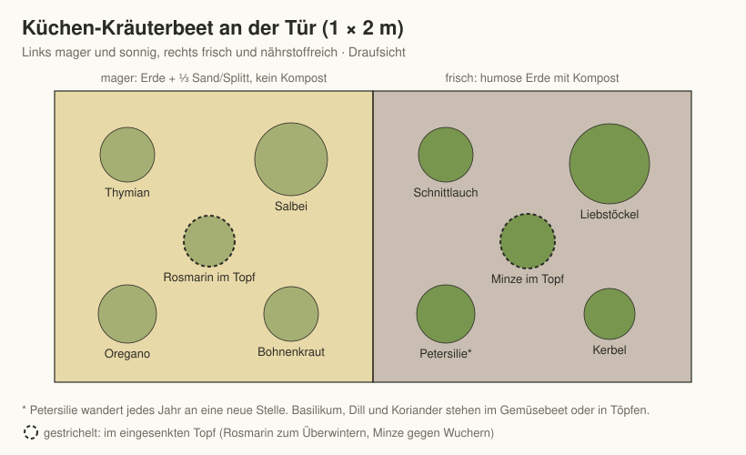

# Kapitel 8 – Kräuter im Selbstversorger-Garten

Gemessen am Ladenpreis ist kein Beet rentabler als das Kräuterbeet: Ein
Bund Petersilie kostet im Laden mehr als ein Samentütchen, das einen
ganzen Sommer liefert. Kräuter würzen die Küche, füllen die Teedose,
locken Bestäuber und Nützlinge – und viele wachsen dort, wo Gemüse
streikt.

Ein Kräutergarten muss nicht groß sein. Zwei, drei Quadratmeter an der
Küchentür, ein paar Töpfe auf der Terrasse und einige Kräuter zwischen
dem Gemüse genügen für einen Haushalt. Entscheidend ist nicht die
Fläche, sondern der richtige Platz für jede Art.

## Zwei Welten: mediterran und heimisch

Kräuter scheitern fast immer am falschen Standort, selten an falscher
Pflege. Merken Sie sich zwei Gruppen:

**Die Mediterranen – mager, sonnig, trocken:** Thymian, Rosmarin, Salbei,
Oregano, Lavendel, Bohnenkraut (mehrjährige Bergform), Currykraut. Sie
wollen durchlässigen, kalkhaltigen, **nährstoffarmen** Boden und volle
Sonne. Kompost und häufiges Gießen bringen sie um – buchstäblich: Der
häufigste Kräutertod ist der Wurzeltod im nassen Winterboden. Auf schweren
Böden ins Hochbeet mit Sand- oder Splittanteil oder in Töpfe. Rosmarin
ist nur bedingt winterhart: geschützt stellen oder einräumen.

**Die Frischen – nährstoffreich, gleichmäßig feucht:** Petersilie,
Schnittlauch, Basilikum, Dill, Koriander, Kerbel, Liebstöckel, Minze,
Zitronenmelisse, Estragon, Sauerampfer. Sie mögen humosen Gartenboden,
Sonne bis Halbschatten und regelmäßiges Wasser – also gemüseähnliche
Bedingungen; viele passen direkt ins Gemüsebeet.

**Sonderfall Minze und Melisse:** Minze wuchert über Ausläufer,
Zitronenmelisse versamt sich kräftig. Minze nur mit Wurzelsperre (großer
Topf ohne Boden, eingegraben) ins Beet – oder gleich in Kübel; bei der
Melisse die Blütenstände vor der Samenreife abschneiden.

## Die wichtigsten Kräuter im Überblick

Die Angaben stammen wie in Kapitel 6 aus dem Kulturen-Datensatz zum Buch.

| Kraut | Gruppe | Lebensdauer | Anzucht / Aussaat | Pflanzung | Ernte | Haltbar machen |
|-------|--------|-------------|-------------------|-----------|-------|----------------|
| Petersilie | frisch | zweijährig | vorziehen Feb–Mär, säen Mär–Jul | Apr–Mai | Mai–Nov | einfrieren, trocknen |
| Schnittlauch | frisch | mehrjährig | vorziehen Feb–Mär, säen Mär–Mai | Mär–Apr, Sep–Okt | Mär–Nov | einfrieren |
| Basilikum | frisch, wärmebedürftig | einjährig | vorziehen Mär–Mai | Mai–Jun | Jun–Sep | Pesto, einfrieren |
| Dill | frisch | einjährig | säen Apr–Jul | – | Mai–Sep | einfrieren, trocknen |
| Koriander | frisch | einjährig | säen Apr–Aug | – | Mai–Okt | einfrieren, Samen trocknen |
| Liebstöckel | frisch | mehrjährig | vorziehen Mär, säen Apr–Mai | Apr–Mai, Sep–Okt | Apr–Okt | trocknen, einfrieren |
| Minze | frisch | mehrjährig | – (Teilung, Ausläufer) | Apr–Mai, Sep–Okt | Mai–Sep | trocknen |
| Zitronenmelisse | frisch | mehrjährig | – (Teilung) | Apr–Mai, Sep–Okt | Mai–Sep | trocknen |
| Thymian | mediterran | mehrjährig | vorziehen Mär–Apr | Apr–Mai | Mai–Okt | trocknen |
| Salbei | mediterran | mehrjährig | vorziehen Mär–Apr | Apr–Mai | Apr–Okt | trocknen |
| Oregano / Majoran | mediterran | mehrjährig / einjährig | vorziehen Mär–Apr, säen Mai | Apr–Mai | Jun–Sep | trocknen |
| Rosmarin | mediterran | mehrjährig, frostempfindlich | – (Stecklinge, Kauf) | Apr–Mai | ganzjährig | trocknen |
| Ringelblume | Blüte | einjährig | säen Mär–Jun | – | Jun–Okt | Blüten trocknen |
| Kapuzinerkresse | Blüte | einjährig | vorziehen Apr, säen Mai–Jun | Mai | Jun–Okt | Knospen einlegen |

## Einjährig, zweijährig, mehrjährig

- **Einjährige** (Basilikum, Dill, Koriander, Kerbel, Majoran): jedes
  Jahr säen, gern in Sätzen. Dill und Koriander säen sich im Gemüsebeet
  freundlich selbst aus und schießen im Sommer schnell – alle drei bis
  vier Wochen eine kurze Reihe nachsäen. Basilikum ist wärmebedürftig –
  erst nach den Eisheiligen raus, besser noch in den Topf auf die warme
  Terrasse.
- **Zweijährige** (Petersilie, Kümmel): Blattjahr, dann Blüte.
  Petersilie keimt quälend langsam (drei bis vier Wochen) – Geduld,
  gleichmäßig feucht halten und jedes Jahr an eine Stelle säen, an der
  drei bis vier Jahre keine Petersilie und möglichst auch keine anderen
  Doldenblütler wie Möhre, Sellerie oder Dill standen (sie ist
  selbstunverträglich). Auch im Küchenbeet wandert sie deshalb jährlich. Im zweiten Jahr liefert sie im Frühjahr noch
  eine frühe Ernte, dann schießt sie.
- **Mehrjährige und Stauden** (Schnittlauch, Liebstöckel, Estragon,
  Minze, Zitronenmelisse, Sauerampfer und alle Mediterranen): einmal
  pflanzen, jahrelang ernten. Das Rückgrat des Kräutergartens – und der
  beste Einstieg: Kaufen Sie die mehrjährigen Kräuter im ersten Jahr als
  Jungpflanzen, säen Sie die einjährigen selbst.

## Kräuter vermehren

Mehrjährige Kräuter lassen sich leicht selbst vermehren – so wird aus
einer gekauften Pflanze in zwei Jahren ein ganzes Beet, und Nachbarn
freuen sich über Ableger.

| Methode | Wann | Geeignet für | So geht's |
|---------|------|--------------|-----------|
| **Teilung** | Frühjahr oder Herbst | Schnittlauch, Minze, Melisse, Oregano, Liebstöckel, Estragon | Wurzelballen ausgraben, mit dem Spaten in faustgroße Stücke teilen, neu pflanzen |
| **Stecklinge** | Mai–August | Rosmarin, Salbei, Thymian, Lavendel, Minze | 8–10 cm lange, nicht blühende Triebspitzen schneiden, untere Blätter entfernen, in Anzuchterde mit Sand stecken, feucht und hell halten |
| **Absenker** | Frühjahr bis Sommer | Thymian, Salbei, Rosmarin | biegsamen Trieb zum Boden ziehen, mit Erde bedecken und fixieren, nach der Bewurzelung abtrennen |
| **Aussaat** | Frühjahr | alle Einjährigen, Petersilie, Schnittlauch, Thymian | Lichtkeimer (Basilikum, Thymian, Majoran) nur andrücken; Kapitel 5 |

Schnittlauch alle drei bis vier Jahre teilen: Das verjüngt den Horst und
hält ihn produktiv.

## Das Kräuterbeet anlegen

### Das Küchenbeet an der Tür

Das wichtigste Kräuterbeet liegt so nah an der Küche, dass Sie auch im
Regen barfuß hingehen können. Ein Beet von 1 × 2 m reicht für einen
Haushalt. Teilen Sie es in zwei Zonen:

| Zone | Boden | Kräuter |
|------|-------|---------|
| **Sonnige, magere Hälfte** | Gartenerde mit einem Drittel Sand oder Splitt, kein Kompost | Thymian, Salbei, Oregano, Bohnenkraut, Lavendel; Rosmarin im Topf eingesenkt |
| **Frische Hälfte** | humose Gartenerde mit Kompost | Schnittlauch, Petersilie, Liebstöckel (am Rand, wird groß), Kerbel, Estragon; Minze im eingegrabenen Topf |

*Abbildung 8.1: Küchen-Kräuterbeet mit magerer und frischer Hälfte.*

Basilikum, Dill und Koriander wandern als Einjährige ins Gemüsebeet oder
in Töpfe – dort finden sie die Wärme und den frischen Boden, den sie
brauchen, und passen in die Fruchtfolge (Kapitel 9).

### Die Kräuterspirale – sinnvoll oder Deko?

Eine Kräuterspirale schafft auf wenigen Quadratmetern ein Gefälle von
mager-trocken (oben, Südseite) bis feucht-nährstoffreich (unten): oben
Thymian und Rosmarin, in der Mitte Salbei und Oregano, unten Petersilie
und Schnittlauch. Sie funktioniert – wenn sie groß genug gebaut wird
(mindestens 2,5–3 m Durchmesser, 80 cm Höhe) und oben wirklich mager
befüllt ist.

**Bau in Kürze:**

1. Kreis von 2,5–3 m markieren, Grasnarbe abheben.
2. Eine Spirale aus Natursteinen trocken aufschichten, die von außen
   (Südseite, flach) nach innen auf 80 cm ansteigt.
3. Innen einen Kern aus Schotter und Bauschutt aufschütten – er sorgt
   für Drainage.
4. Oben mit einem mageren Gemisch aus Sand, Splitt und etwas Erde
   füllen, nach unten zunehmend mit Gartenerde und Kompost.
5. Am Fuß der Spirale, im Süden, ein kleiner Teich oder eine feuchte Zone
   für Brunnenkresse und Minze – optional.

Wer den Platz nicht hat, fährt mit zwei getrennten Bereichen genauso gut:
ein mageres Sonnenbeet und ein frisches Küchenbeet an der Tür.

### Kräuter in Töpfen und auf dem Balkon

Fast alle Kräuter gedeihen in Töpfen – oft sogar besser als im Beet, weil
sich die Bedingungen genau steuern lassen:

- **Topfgröße:** mindestens 3 Liter für Einjährige, 10–20 Liter für
  Rosmarin, Salbei und Liebstöckel.
- **Erde:** Für Mediterrane Kräutererde oder Gartenerde mit einem Drittel
  Sand; für Frische humose Erde mit Kompost.
- **Abzugslöcher und Drainage** (eine Schicht Blähton oder Kies) sind
  Pflicht – Staunässe ist der häufigste Topfkräutertod.
- **Gießen:** Mediterrane erst, wenn die Erde oben trocken ist;
  Basilikum und Petersilie gleichmäßig feucht halten, morgens gießen.
- **Düngen:** Frische Kräuter im Topf alle zwei bis drei Wochen mit
  verdünnter Jauche (Kapitel 10), Mediterrane gar nicht.

### Kräuter über den Winter bringen

- **Winterhart im Beet:** Thymian, Salbei, Oregano, Schnittlauch,
  Liebstöckel, Minze, Melisse, Lavendel. Auf nassen Böden vertragen die
  Mediterranen die Kälte, aber nicht die Nässe – Drainage ist der beste
  Winterschutz.
- **Bedingt winterhart:** Rosmarin (je nach Sorte bis −10 bis −15 °C),
  Lorbeer, Zitronenverbene. Im Kübel hell und kühl (5–10 °C) überwintern,
  sparsam gießen.
- **Frost im Topf:** Kübel mit Mehrjährigen im Winter an die Hauswand
  rücken, auf Holz stellen und mit Vlies oder Jute umwickeln – die
  Wurzeln im Topf erfrieren schneller als im Beet.
- **Winterkräuter vom Fenster:** Schnittlauch im Herbst ausgraben, einige
  Wochen draußen Frost bekommen lassen, dann in einem Topf ins Haus
  holen – er treibt am Fenster neu aus. Kresse und Kräuter-Microgreens
  liefern im Winter frisches Grün (Kapitel 12).

## Ernten, aber richtig

- **Regelmäßig schneiden hält jung.** Kräuter, die nie geerntet werden,
  vergreisen und blühen sich zu Tode. Schnittlauch büschelweise bodennah,
  Petersilie äußere Stiele (das Herz stehen lassen), Basilikum **ganze
  Triebspitzen** über einem Blattpaar (nie einzelne Blätter zupfen).
- **Der beste Erntezeitpunkt** für Aroma: später Vormittag eines trockenen
  Tages, kurz **vor** der Blüte – dann ist der Gehalt ätherischer Öle am
  höchsten.
- **Mediterrane** nach der Blüte um ein Drittel zurückschneiden, das hält
  sie kompakt; nie tief ins alte, blattlose Holz von Lavendel und
  Rosmarin schneiden – es treibt nicht wieder aus.
- **Samen ernten:** Dill, Koriander, Fenchel und Kümmel liefern
  Gewürzsamen. Dolden kurz vor der Vollreife abschneiden, kopfüber in
  einer Papiertüte nachtrocknen lassen.
- **Blüten:** Schnittlauch-, Borretsch-, Ringelblumen- und
  Kapuzinerkresseblüten sind essbar und machen jeden Salat zum Fest.

## Haltbarmachen: Trocknen, Einfrieren, Salz und Öl

- **Trocknen** (ideal für Thymian, Oregano, Salbei, Minze, Teekräuter):
  Sträußchen kopfüber an einem warmen, dunklen, luftigen Ort – nicht in
  der Sonne, nicht über 40 °C. Rascheltrocken in dunkle Gläser rebeln;
  Aroma hält etwa ein Jahr. Petersilie, Schnittlauch und Basilikum
  verlieren getrocknet den größten Teil ihres Aromas.
- **Einfrieren** (besser für Petersilie, Schnittlauch, Dill, Basilikum):
  gehackt in Eiswürfelformen mit etwas Wasser oder Öl – portionsweise
  Sommer im Winter.
- **Kräutersalz:** Gehackte frische Kräuter 1:5 mit grobem Salz
  vermörsern, auf einem Blech an der Luft trocknen lassen, in Gläser
  füllen. Das Salz konserviert und nimmt das Aroma auf.
- **Kräuteressig:** Trockene Kräuterzweige (Estragon, Dill, Thymian) in
  Essig einlegen, zwei Wochen ziehen lassen, abseihen – sicher und lange
  haltbar.
- **Kräuteröl und Pesto:** Öl mit Kräutern ist heikel, weil unter Öl
  Luftabschluss herrscht und sich wie beim Einkochen Botulismus-Gift
  bilden kann (Kapitel 13). Kräuteröl mit frischen Kräutern nur in
  kleinen Mengen ansetzen, im Kühlschrank lagern und möglichst am
  nächsten Tag, spätestens nach vier Tagen verbrauchen. Getrocknete
  Kräuter senken das Risiko deutlich, schließen es aber nicht sicher aus.
  Pesto bindet Basilikum-Überschüsse am köstlichsten – im Kühlschrank
  wenige Tage, portionsweise eingefroren monatelang.

## Teekräuter: die Hausapotheke im Beet

Pfefferminze, Zitronenmelisse, Kamille (einjährig, säen), Salbei, Fenchel
(Samenernte), Ringelblume und Malve (Blüten) füllen die Teedose fürs
ganze Jahr. Dazu Holunder- und Lindenblüten vom Gehölzrand und Hagebutten
aus der Hecke – kostenlose Vitamine.

**Bewährte Mischungen aus dem eigenen Garten:**

| Mischung | Zutaten (zu gleichen Teilen) | Wofür |
|----------|------------------------------|-------|
| Frühstückstee | Pfefferminze, Zitronenmelisse, Brombeerblätter | frisch, alltagstauglich |
| Abendtee | Zitronenmelisse, Kamille, Lavendelblüten (wenig) | zur Beruhigung |
| Wintertee | Salbei, Thymian, Holunderblüten | für kalte Tage |
| Kindertee | Fenchelsamen, Kamille, Apfelschalen | mild |
| Wiesentee | Brennnessel, Frauenmantel, Himbeerblätter | Alltagstee aus Wildkräutern |

Heilkräuter sind milde Hausmittel, kein Ersatz für ärztlichen Rat. Wer
schwanger ist, Kinder versorgt oder regelmäßig Medikamente nimmt, klärt
größere Mengen vorher ab.

## Wildkräuter: die Ernte, die niemand gesät hat

Viele „Unkräuter" im Selbstversorger-Garten sind wertvolle Nahrung:

- **Brennnessel:** junge Triebspitzen wie Spinat, getrocknet als Tee,
  Grundlage der Jauche (Kapitel 10).
- **Giersch:** junge Blätter wie Petersilie oder Spinat – die schönste
  Rache am hartnäckigsten Beikraut.
- **Vogelmiere:** zart und mild im Salat, wächst fast das ganze Jahr.
- **Löwenzahn:** junge Blätter als Bittersalat, Blüten für Sirup.
- **Bärlauch:** im schattigen Gartenteil oder unter Sträuchern
  anzusiedeln, Ernte im März und April.

**Sicherheitsregel für alle Wildkräuter:** Nur ernten, was zweifelsfrei
bestimmt ist. Bärlauch lässt sich mit den giftigen Maiglöckchen, dem
Aronstab und der tödlich giftigen Herbstzeitlose verwechseln. Bärlauch
riecht beim Zerreiben eines Blattes deutlich nach Knoblauch – aber
Vorsicht, der Geruch haftet an den Fingern und täuscht beim nächsten
Blatt. Die Geruchsprobe ist deshalb nur eine erste Orientierung; achten
Sie zusätzlich auf die Blattmerkmale (jedes Bärlauchblatt hat einen
eigenen Stiel, die Blattunterseite ist matt). Pflanzen Sie Bärlauch im
Garten nicht neben Maiglöckchen, und ernten Sie Blatt für Blatt einzeln
statt büschelweise. Im Zweifel stehen lassen.

## Kräuter als Teamspieler

Blühende Kräuter sind Nützlingsmagneten erster Klasse: Dill, Fenchel und
Koriander ernähren Schwebfliegen (deren Larven Blattläuse fressen),
Thymian, Oregano und Borretsch summen vor Wildbienen und Hummeln,
Ringelblume und Kapuzinerkresse lockern als essbare Blüten jedes
Gemüsebeet auf. Lassen Sie deshalb immer einen Teil der Kräuter zur Blüte
kommen – der Garten dankt es (mehr dazu in Kapitel 9 und 11).

Bewährte Plätze für Kräuter im Gemüsebeet:

- **Dill** zu Gurken und Möhren,
- **Basilikum** zu Tomaten unter dem Regendach,
- **Bohnenkraut** zu Buschbohnen,
- **Schnittlauch** und **Petersilie** als Beeteinfassung,
- **Borretsch** und **Ringelblume** an die Beetenden.

## Das Wichtigste in Kürze

- Standort schlägt Pflege: Mediterrane mager und trocken, Küchenkräuter
  frisch und nahrhaft.
- Minze nur mit Wurzelsperre, Melisse vor der Samenreife schneiden;
  Basilikum warm; Petersilie braucht Geduld und jährlich frischen Platz.
- Mehrjährige Kräuter zuerst pflanzen und selbst vermehren – Teilung,
  Stecklinge, Absenker.
- Ein Küchenbeet an der Tür mit magerer und frischer Hälfte genügt; die
  Kräuterspirale nur in ausreichender Größe.
- Regelmäßig und richtig ernten hält die Pflanzen produktiv; vor der
  Blüte steckt das meiste Aroma.
- Trocknen für die Mediterranen und Teekräuter, Einfrieren für die
  Feinen, Pesto für den Rest; Kräuteröl nur in kleinen Mengen, kühl und
  wenige Tage lagern.
- Wildkräuter nur ernten, wenn sie zweifelsfrei bestimmt sind.
- Kräuter blühen lassen: Sie sind die Kantine Ihrer Nützlinge.
