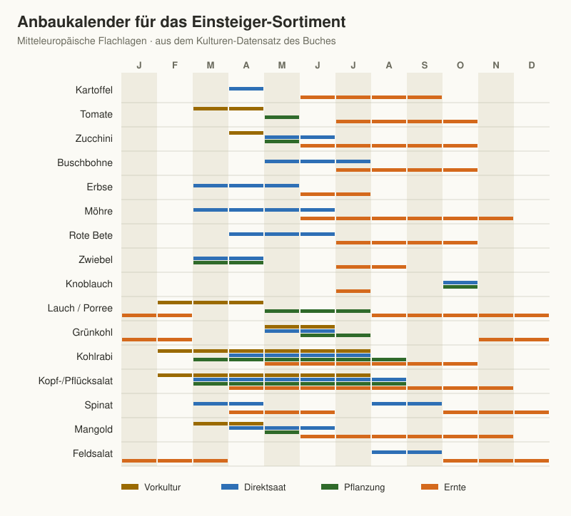

# Kapitel 12 – Das Gartenjahr – Monat für Monat

Dieses Kapitel ist zum Nachschlagen gedacht: der Jahreslauf des
Selbstversorger-Gartens im mitteleuropäischen Flachlandklima, Monat für
Monat. Jeder Monat ist gleich aufgebaut – **Säen und vorziehen**,
**Pflanzen**, **Pflegen**, **Ernten** und **Obst und Beeren** –, damit
Sie beim schnellen Blättern immer an derselben Stelle finden, was ansteht.
Die Termine entsprechen dem Kulturen-Datensatz, aus dem auch der
Anbaukalender und die App zum Buch gespeist werden.

## Kalender oder Natur?

Kalenderdaten sind ein Geländer, kein Gesetz. In rauen Lagen und in
Höhenlagen verschieben sich die Frühjahrsarbeiten um zwei bis vier Wochen
nach hinten, die Herbstarbeiten nach vorn. Und selbst im selben Garten
unterscheiden sich zwei Frühjahre um Wochen. Entscheidend sind drei
Fragen, die der Kalender nicht beantworten kann:

1. **Ist der Boden bereit?** Nehmen Sie eine Handvoll Erde und drücken Sie
   sie zusammen. Zerfällt der Ballen beim Antippen, ist der Boden
   abgetrocknet und bearbeitbar. Schmiert er, warten Sie.
2. **Ist der Boden warm genug?** Ein einfaches Bodenthermometer in 5 cm
   Tiefe erspart viel Rätselraten: Spinat, Erbsen und Radieschen keimen ab
   etwa 5 °C, Möhren ab 5 °C (zügig erst ab etwa 8 °C), Bohnen und Zucchini
   erst ab 10–12 °C, Gurken ab 12–15 °C.
3. **Was sagt die Natur?** Pflanzen zeigen den Stand der Jahreszeit
   zuverlässiger an als jedes Datum – das ist die Idee des
   **phänologischen Kalenders**.

### Der phänologische Kalender

Der Deutsche Wetterdienst teilt das Jahr in zehn Jahreszeiten, die nicht
an Daten, sondern an Zeigerpflanzen erkannt werden. Für den Gemüsegarten
sind diese Zeichen am nützlichsten:

| Phänologische Jahreszeit | Zeigerpflanze | Was jetzt im Garten passt |
|--------------------------|---------------|---------------------------|
| Vorfrühling | Hasel stäubt, Schneeglöckchen blühen | Dicke Bohnen säen, Anzucht von Paprika und Sellerie |
| Erstfrühling | Forsythie blüht | Erbsen, Spinat, Radieschen, Möhren ins Freie; Steckzwiebeln |
| Vollfrühling | Apfel blüht | Kartoffeln legen, Rote Bete und Mangold säen; letzte Nachtfröste möglich |
| Frühsommer | Holunder blüht | Tomaten, Zucchini, Gurken sicher auspflanzen; Bohnen säen |
| Hochsommer | Linde blüht | Möhren für das Lager und Grünkohl sind längst im Beet; Beeren ernten |
| Spätsommer | Frühäpfel pflückreif, Vogelbeeren (Eberesche) reif | Feldsalat und Spinat säen, Erdbeeren pflanzen |
| Frühherbst | Holunderbeeren reif | Kartoffeln und Kürbisse ernten, letzte Aussaat von Winterportulak |
| Vollherbst | Eicheln reif (ersatzweise: Rosskastanien fallen) | Wurzelgemüse einlagern, Knoblauch stecken |
| Spätherbst | Stiel-Eiche verfärbt ihr Laub (ersatzweise: Eberesche wirft die Blätter ab) | Gehölze pflanzen, Beete winterfest machen |
| Winter | Stiel-Eiche wirft ihr Laub ab (ersatzweise: Lärche verliert die Nadeln) | Planen, Werkzeug pflegen, Wintergemüse ernten |

Notieren Sie im Gartentagebuch, wann in Ihrem Garten die Forsythie, der
Apfel und der Holunder blühen. Nach zwei, drei Jahren wissen Sie genauer
als jeder Kalender, wann bei Ihnen „April" ist.

---

## Januar – Planen und Schärfen

Der ruhigste Monat des Jahres ist der wichtigste für die Planung. Was
jetzt auf Papier steht, muss im April nicht mehr im Kopf sortiert werden.

**Planen.** Fruchtfolge für das neue Jahr festlegen: Jede Gruppe rückt
ein Feld weiter (Kapitel 9). Gartentagebuch des Vorjahres auswerten:
Welche Sorte hat getragen, wovon gab es zu viel, wovon zu wenig? Daraus
die Saatgutliste erstellen und früh bestellen – beliebte samenfeste
Sorten sind im März oft ausverkauft. Altes Saatgut mit einer
**Keimprobe** prüfen (Kapitel 5).

**Säen und vorziehen.** Noch nichts – außer Kresse und Sprossen auf der
Fensterbank, die jetzt das frische Grün liefern.

**Pflegen.** Werkzeug schärfen, ölen, reparieren; Stangen, Rankgitter und
Vliese prüfen. Lager wöchentlich kontrollieren und Faulendes sofort
entfernen – eine faule Kartoffel steckt ihre Nachbarn an. Bei Schnee die
Wintergemüse nicht betreten, Gewächshausdächer freiräumen.

**Ernten.** Grünkohl, Rosenkohl, Winterlauch, Pastinaken, Schwarzwurzeln,
Topinambur, Feldsalat und Asia-Salate aus dem Beet; aus dem Lager
Kartoffeln, Möhren, Rote Bete, Sellerie, Kohl, Zwiebeln, Kürbis und Äpfel.

**Obst und Beeren.** An frostfreien Tagen mit dem Winterschnitt beim
Kernobst (Apfel, Birne) beginnen – nicht unter −5 °C schneiden, das Holz
splittert. Weißanstrich an jungen Stämmen erneuern.

---

## Februar – Die Startlinie

Die Tage werden spürbar länger, und das Gartenjahr beginnt auf der
Fensterbank. Wer jetzt zu früh zu viel aussät, hat im April vergeilte
Pflanzen – wer die Langsamstarter verpasst, erntet im Herbst keine Paprika.

**Säen und vorziehen.** Die Kulturen mit der längsten Anzucht:
**Paprika, Chili und Aubergine** warm (24–28 °C), **Knollensellerie** als
Lichtkeimer, **Lauch** dicht in Schalen. Ende des Monats erste Salate,
Kohlrabi, Petersilie und Schnittlauch. Im Freien: **Dicke Bohnen**, sobald
der Boden offen ist – die früheste Direktsaat des Jahres.

**Pflanzen.** Beerensträucher bei offenem Boden.

**Pflegen.** Frühbeet und Gewächshaus vorbereiten, Vlies und Folientunnel
bereitlegen. Auf abgetrocknetem Boden die Beete von grobem Wintermulch
befreien, damit sich die Erde erwärmt. Kartoffel-Pflanzgut kaufen, solange
die Auswahl groß ist.

**Ernten.** Wie im Januar; die Lager leeren sich. Letzte Grünkohl- und
Rosenkohlernte, Pastinaken und Topinambur nach Bedarf.

**Obst und Beeren.** Johannisbeeren und Stachelbeeren schneiden: die
ältesten Triebe bodennah heraus. Herbsthimbeeren komplett bodennah
abschneiden. Kernobstschnitt fortsetzen.

---

## März – Der Boden erwacht

Jetzt geht es draußen los – aber nur, wo der Boden abgetrocknet ist. Im
März zerstört ein zu früh bearbeiteter, nasser Boden mehr, als die
Ungeduld gewinnt.

**Säen und vorziehen.** Auf der Fensterbank: **Tomaten** ab Mitte März,
dazu Brokkoli, Weiß- und Rotkohl, Wirsing, Blumenkohl, Mangold, Salate,
Thymian, Salbei und Oregano. Im Freien unter Vlies, sobald der Boden
5–8 °C hat: **Radieschen, Spinat, Möhren, Pastinaken, Erbsen**,
Schwarzwurzeln, Mairüben, Rucola, Asia-Salate und Petersilie.

**Pflanzen.** Steckzwiebeln und Schalotten, erste vorgezogene Salate und
Kohlrabi unter Vlies. Rhabarber, Spargel und Topinambur pflanzen oder
teilen. Schnittlauch teilen.

**Pflegen.** **Kartoffeln zum Vorkeimen** hell und kühl auslegen. Kompost
umsetzen und reifen Kompost auf die Beete von „Kohl & Co." und
„Fruchtgemüse" bringen (3–4 l/m², Kapitel 9 und 10). Gründüngung vom
Vorjahr abmähen und liegen lassen. Sämlinge auf der Fensterbank
pikieren, sobald das erste echte Blatt erscheint (Kapitel 5).

**Ernten.** Feldsalat, Winterportulak, überwinterter Spinat, erste
Schnittlauchspitzen; Reste aus dem Lager.

**Obst und Beeren.** Obstbaumschnitt abschließen, bevor die Knospen
schwellen. Erdbeerbeete säubern, alte Blätter entfernen, eine dünne
Kompostgabe geben.

---

## April – Pflanzmonat mit Nervenprobe

Der April schwankt zwischen Sommertag und Schneeschauer. Robuste
Kulturen gehen jetzt ins Freie, frostempfindliche bleiben drinnen – so
schwer es fällt.

**Säen und vorziehen.** Auf der Fensterbank oder im Frühbeet: **Zucchini,
Kürbis, Gurken und Zuckermais** in der zweiten Monatshälfte in Töpfen,
dazu Palm- und Rosenkohl, Pak Choi und Basilikum. Im Freien: **Rote
Bete, Mangold**, Rettich, Kohlrabi, Dill, Koriander, weitere Sätze
Möhren, Radieschen und Salat.

**Pflanzen.** Salate, Kohlrabi, **Brokkoli, Blumenkohl und Wirsing** –
sofort unter das Kulturschutznetz. Ab Mitte des Monats **Kartoffeln
legen**. Petersilie und mehrjährige Kräuter setzen, Spargel pflanzen.

**Pflegen.** **Beikraut jetzt wöchentlich hacken** – der April entscheidet,
wie viel Sie im Juni jäten. Jungpflanzen für den Mai schrittweise
abhärten. Schneckenschutz aufbauen, bevor die ersten Salate gesetzt
werden. Vlies griffbereit halten, Spätfrostwarnungen beachten.

**Ernten.** Radieschen, Schnittsalat, überwinterter Spinat, Asia-Salate,
Rhabarber (im zweiten Standjahr zurückhaltend), erster Spargel.

**Obst und Beeren.** Obstblüte: Bei Spätfrostwarnung empfindliche Blüten
(Aprikose, Pfirsich, frühe Birnen) mit Vlies schützen. Erdbeeren bei
Frost in der Blüte abdecken.

---

## Mai – Alles raus (aber erst nach den Eisheiligen)

Der Monat mit der meisten Arbeit – und der größten Versuchung. Bis Mitte
Mai können Nachtfröste die Tomaten in einer Nacht erfrieren lassen; die
Eisheiligen (11. bis 15. Mai) sind eine Faustregel, kein Datum aus
Stein.

**Säen und vorziehen.** Im Freien ab Mitte Mai, wenn der Boden 10 °C
hat: **Busch- und Stangenbohnen**, Zucchini, Kürbis, Gurken und Mais als
Direktsaat. Vorkultur für den Herbst: **Grünkohl**, Radicchio, Fenchel,
Steckrüben. Laufend Salat, Radieschen, Dill und Koriander.

**Pflanzen.** Nach den Eisheiligen: **Tomaten** unters Dach, **Paprika**,
Auberginen, **Zucchini, Kürbis, Gurken**, Zuckermais im Block,
Knollensellerie (flach!), Weiß- und Rotkohl, Rosenkohl, Mangold,
**Lauch** (bleistiftdick, in Pflanzlöcher), Basilikum.

**Pflegen.** Jungpflanzen vor dem Auspflanzen eine Woche abhärten
(Kapitel 5). Kartoffeln das erste Mal anhäufeln. **Mulchen, sobald der
Boden warm ist** – nicht früher, sonst bleibt er kalt. Schneckenkontrolle
am Abend. Tomaten-Regendach aufbauen, bevor die Pflanzen hineinkommen.

**Ernten.** Salate, Radieschen, Kohlrabi, Spinat, Rhabarber, Spargel,
Frühlingszwiebeln, Schnittlauch und frische Kräuter.

**Obst und Beeren.** Erdbeeren mit Stroh unterlegen, sobald sich die
Früchte bilden. Monilia-Spitzen an Sauerkirsche und Aprikose bis ins
gesunde Holz ausschneiden. Hat der Apfel übervoll angesetzt, jetzt früh
ausdünnen, solange die Früchtchen kleiner als eine Walnuss sind – das
beugt dem Aussetzen im nächsten Jahr vor (Kapitel 7).

---

## Juni – Wachstum und erste Fülle

Die Tage sind am längsten, alles wächst sichtbar. Die ersten großen
Ernten kommen, und gleichzeitig werden die Beete für den Herbst bestellt.

**Säen und vorziehen.** **Lagermöhren** und Lager-Rote-Bete – die Junisaat
entgeht der ersten Möhrenfliegen-Generation. Zweiter Satz Buschbohnen,
Stangenbohnen bis Mitte Juni, Fenchel, Endivie, Zuckerhut, Radicchio,
Steckrüben. Vorkultur Chinakohl gegen Monatsende.

**Pflanzen.** **Grünkohl und Palmkohl**, Rosenkohl, Brokkoli-Folgesätze,
Lauch, Radicchio.

**Pflegen.** Tomaten wöchentlich ausgeizen und aufbinden. Kartoffeln zum
zweiten Mal anhäufeln, **Kartoffelkäfer absammeln**. Gießen: selten, aber
durchdringend, morgens. Freiwerdende Flächen nach Erbsen und Dicken
Bohnen sofort neu bestellen. Brennnesseljauche ansetzen (Kapitel 10).

**Ernten.** Salate, Radieschen, Kohlrabi, **Zuckererbsen und Markerbsen**,
Dicke Bohnen, **Frühkartoffeln**, erste Zucchini, Frühlingszwiebeln,
Wintersteckzwiebeln, Knoblauchschlangen; **Rhabarber und Spargel bis
Johanni (24. Juni)**, danach der Pflanze Ruhe gönnen.

**Obst und Beeren.** Erdbeeren, erste Johannisbeeren und Kirschen ernten.
Beim Apfel nach dem natürlichen **Junifall** zu dicht hängende Früchte
auf ein bis zwei pro Büschel ausdünnen – das bringt größere Äpfel. Gegen
das Aussetzen im Folgejahr hilft nur das frühe Ausdünnen im Mai.

---

## Juli – Ernten, gießen, nachpflanzen

Hochsaison. Der Garten verlangt jetzt vor allem zwei Dinge: Wasser und
regelmäßiges Pflücken. Gleichzeitig ist der Juli der letzte Monat, in
dem sich die Herbst- und Winterernte noch entscheidet.

**Säen und vorziehen.** **Letzte Buschbohnen Anfang Juli.** Danach
Chinakohl, Pak Choi, Endivie, Herbstrüben, Winterrettich, Steckrüben –
die Kulturen für den Herbst.

**Pflanzen.** **Grünkohl bis Mitte Juli**, Chinakohl, Endivie, Zuckerhut,
letzter Lauch, Brokkoli für die Herbsternte, Kohlrabi.

**Pflegen.** Zucchini und Gurken **alle zwei Tage durchpflücken**.
Tomaten weiter ausgeizen, Braunfäule-Blätter sofort entfernen.
Starkzehrer wöchentlich mit verdünnter Jauche versorgen. Mulchschicht
ergänzen. Freiwerdende Beete sofort neu besäen oder mit Phacelia
begrünen (Kapitel 9).

**Ernten.** Die große Fülle: Zucchini, Gurken, **Tomaten** (ab Mitte
Juli), Paprika, Buschbohnen, Rote Bete, Möhren, Kohlrabi, Brokkoli,
Mangold, Salate; **Knoblauch**, wenn das untere Laubdrittel vergilbt;
Zwiebeln und Schalotten, wenn das Laub umfällt.

**Obst und Beeren.** Johannisbeeren, Stachelbeeren, Sommerhimbeeren,
Heidelbeeren. **Süßkirschen direkt nach der Ernte schneiden.**
Abgetragene Himbeerruten bodennah entfernen. Erdbeerbeete nach der Ernte
putzen, kräftige Ausläufer für die Neupflanzung bewurzeln lassen.

---

## August – Der Vorratsmonat beginnt

Die Küche wird zur Werkstatt. Was jetzt eingekocht, eingelegt, getrocknet
und eingefroren wird, isst man im Winter (Kapitel 13). Zugleich wird
schon für den Winter gesät.

**Säen und vorziehen.** **Feldsalat** ab Ende August, **Spinat** für
Herbst und Überwinterung, Asia-Salate, Herbstrüben, Radieschen,
Winterrettich bis Monatsmitte. Gründüngung auf alles, was frei wird.

**Pflanzen.** **Erdbeeren neu pflanzen** – jetzt gepflanzt, tragen sie im
nächsten Jahr voll. Endivie, Chinakohl, Pak Choi.

**Pflegen.** Bei Hitze Mulch prüfen und gezielt wässern, besonders
Neupflanzungen und Hochbeete. Tomaten-Triebspitzen ab Ende August kappen.
Zwiebeln nach der Ernte zwei Wochen trocken nachreifen lassen.
**Kräuter für den Wintervorrat** vor der Blüte schneiden und trocknen.

**Ernten.** Tomaten, Paprika, Gurken, Zucchini, Bohnen, Mais,
Möhren, Rote Bete, Mangold, Lauch, Brokkoli, Kohlrabi, Zwiebeln.
Verarbeiten: Tomatensoße einkochen, Gurken einlegen, Bohnen einfrieren
oder fermentieren, Beeren zu Marmelade.

**Obst und Beeren.** Frühäpfel und Frühbirnen, Brombeeren,
Herbsthimbeeren (ab Ende August). **Sommerschnitt** an Apfel und Birne:
senkrechte Wasserschosse entfernen.

---

## September – Einbringen und Weichenstellen

Der Erntemonat. Die Lager füllen sich, und mit den letzten Aussaaten
werden die Weichen für den Winter und das Frühjahr gestellt.

**Säen und vorziehen.** **Feldsalat bis Mitte September**, Spinat nur
noch Anfang des Monats, **Winterportulak ab Mitte September** (keimt erst
unter 12 °C), Asia-Salate bis Anfang Oktober. Gründüngung: Winterroggen
mit Wicke auf Flächen, die bis zum Frühjahr frei bleiben.

**Pflanzen.** **Wintersteckzwiebeln**, Schnittlauch und mehrjährige
Kräuter teilen und umsetzen. Neupflanzung von Beerensträuchern beginnt.

**Pflegen.** Kulturschutznetz über Lauch und späte Möhren gegen die
zweite Fliegengeneration. Grünkohl und Rosenkohl standfest anhäufeln,
beim Rosenkohl die Spitze kappen. Grüne Tomaten vor dem ersten Frost
abnehmen und drinnen nachreifen lassen.

**Ernten.** **Kartoffel-Haupternte** bei abgestorbenem Kraut, an einem
trockenen Tag; Knollen abtrocknen lassen und dunkel einlagern.
**Kürbisse** reif ernten (verkorkter Stiel, hohler Klang) und warm
nachhärten. Dazu Tomaten, Paprika, Bohnen, Möhren, Rote Bete, Fenchel,
Brokkoli, Endivie, Chinakohl, Mangold, Weißkohl.

**Obst und Beeren.** Äpfel und Birnen ernten: Lagersorten vorsichtig
pflücken (Kippprobe: löst sich die Frucht beim Anheben mit Stiel? Dann
ist sie reif) und nur makellose Früchte kühl einlagern. Zwetschgen,
Herbsthimbeeren, Brombeeren, Holunder. **Leimringe** gegen den
Frostspanner bis Ende September anlegen – die flugunfähigen Weibchen
klettern ab Oktober die Stämme hinauf.

---

## Oktober – Der Lagerkeller füllt sich

Der Garten wird ruhiger, der Keller voller. Oktober ist zugleich der
wichtigste Pflanzmonat für alles, was Jahre bleiben soll.

**Säen und vorziehen.** Winterportulak und Asia-Salate ins Frühbeet oder
Gewächshaus. Gründüngung nur noch mit Winterroggen.

**Pflanzen.** **Knoblauch stecken** – jetzt, nicht im Frühjahr. Letzte
Wintersteckzwiebeln. **Obstbäume, Beerensträucher und Rhabarber
pflanzen** – die beste Pflanzzeit des Jahres, weil die Wurzeln noch vor
dem Winter anwachsen.

**Pflegen.** Laub sammeln: als Mulch unter Hecken und Beeren, als
Laubkompost, als Igelhaufen in der Wildecke. Empfindliche Kräuter
(Rosmarin) einräumen. Regentonnen vor dem ersten Hartfrost teilweise
entleeren. Abgeerntete Beete mulchen oder mit Kompost abdecken.

**Ernten.** **Wurzelernte vor stärkeren Frösten:** Möhren, Rote Bete,
Knollensellerie, Winterrettich, Steckrüben – Laub abdrehen, in feuchtem
Sand einschlagen. Pastinaken und Schwarzwurzeln dürfen im Beet bleiben.
Lagerkohl, Chinakohl, Zuckerhut, Endivie, Radicchio, Kürbisrest, erster
Feldsalat, Lauch, Palmkohl.

**Obst und Beeren.** Lagerobst ernten und einlagern, Fallobst zu Saft
und Mus verarbeiten. Neupflanzungen gut einschlämmen.

---

## November – Zudecken und Abschließen

Die letzte Arbeitsrunde vor dem Winter. Im Selbstversorger-Garten heißt
„winterfest" nicht aufgeräumt und nackt, sondern bedeckt.

**Säen und vorziehen.** Nichts mehr im Freien. Kresse und Sprossen auf
der Fensterbank beginnen die Wintersaison.

**Pflanzen.** Gehölze bei offenem, frostfreiem Boden weiterhin.

**Pflegen.** Abgeerntete Flächen mit Mulch, Laub oder Gründüngung
bedeckt lassen – **kein nackter Boden über Winter, kein Umgraben**
(Ausnahme: schwerer Tonboden, den der Frost krümeln soll). Werkzeug
reinigen und einlagern, Wasserleitungen entleeren. Wintergemüse bei
starkem Frost mit Vlies schützen. Lager wöchentlich kontrollieren.

**Ernten.** **Grünkohl und Rosenkohl** schmecken nach den ersten
Frösten; dazu Lauch, Pastinaken, Schwarzwurzeln, Topinambur, Feldsalat,
Winterportulak, Asia-Salate, Zuckerhut und alles aus dem Lager.

**Obst und Beeren.** Weißanstrich an junge Obstbäume, Baumscheiben
mulchen, Leimringe kontrollieren und bei verschmutzter Klebefläche
erneuern.
Fruchtmumien aus den Bäumen entfernen – sie sind die Infektionsquelle
für die Monilia im nächsten Jahr.

---

## Dezember – Ruhe und Rückblick

Der Garten schläft, der Gärtner zieht Bilanz.

**Säen und vorziehen.** Kresse, Sprossen und Microgreens am Fenster.

**Pflanzen.** –

**Pflegen.** Lager kontrollieren, Eingemachtes durchsehen. Gartentagebuch
abschließen: Was hat getragen, was nicht? Welche Sorte kommt wieder,
welche fliegt raus? Tragen Sie ein, was tatsächlich auf welchem Beet
stand – das ist die Grundlage der Fruchtfolge im Januar.

**Ernten.** Grünkohl, Rosenkohl, Lauch, Pastinaken, Feldsalat, Postelein
aus dem Beet, Lagergemüse, Äpfel und Eingemachtes – der Lohn des Jahres
auf dem Festtagstisch.

**Obst und Beeren.** Ruhe. Saatgutkataloge lesen, träumen, planen – im
Januar geht es von vorn los.

---

## Das Jahr auf einen Blick

*Abbildung 12.1: Anbaukalender für das Einsteiger-Sortiment (Daten: daten/kulturen.json).*

| Monat | Säen und vorziehen | Pflanzen | Haupternte |
|-------|--------------------|----------|------------|
| Jan | – (Kresse, Sprossen) | – | Wintergemüse aus Beet und Lager |
| Feb | Paprika, Sellerie, Lauch; Dicke Bohnen draußen | Beerensträucher | Wintergemüse, Lager |
| Mär | Tomaten, Kohl; draußen Möhren, Erbsen, Spinat, Radieschen | Steckzwiebeln, Salat, Rhabarber | Feldsalat, Postelein |
| Apr | Zucchini, Kürbis, Gurke; draußen Rote Bete, Mangold | Kartoffeln, Kohl, Salat | Radieschen, Spinat, Rhabarber |
| Mai | Bohnen, Zucchini draußen; Grünkohl vorziehen | Tomaten, Paprika, Kürbisgewächse, Lauch, Sellerie | Salate, Kohlrabi, Spargel |
| Jun | Lagermöhren, Lager-Rote-Bete, Bohnen, Endivie | Grün- und Rosenkohl, Lauch | Erbsen, Frühkartoffeln, Erdbeeren |
| Jul | letzte Buschbohnen, Chinakohl, Herbstrüben | Grünkohl (bis Mitte), Endivie | Zucchini, Gurken, Tomaten, Knoblauch, Zwiebeln, Beeren |
| Aug | Feldsalat, Spinat, Asia-Salate | Erdbeeren | Tomaten, Bohnen, alles Fruchtgemüse |
| Sep | Feldsalat (bis Mitte), Winterportulak | Wintersteckzwiebeln | Kartoffeln, Kürbis, Äpfel |
| Okt | Gründüngung Winterroggen | **Knoblauch, Gehölze** | Wurzelgemüse, Lagerkohl |
| Nov | – | Gehölze (frostfrei) | Grünkohl, Rosenkohl, Lauch, Pastinaken |
| Dez | – (Kresse, Sprossen) | – | Wintergemüse, Lager |

## Wann wird es eng? Die Arbeitsspitzen

Kapitel 2 rechnet in der Hauptsaison mit ein bis zwei Stunden pro Woche
je 25 m² Beetfläche. Tatsächlich verteilt sich die Arbeit sehr ungleich:

| Zeitraum | Arbeitsaufwand | Was ihn verursacht |
|----------|----------------|--------------------|
| Dezember–Januar | gering | Planung, Werkzeug, Lagerkontrolle |
| Februar–März | mittel | Anzucht, Beetvorbereitung, Kompost |
| **Mitte April–Mitte Juni** | **hoch** | Pflanzung, Hacken, Schneckenschutz, Gießen |
| Juli | mittel bis hoch | Gießen, Pflücken, Nachpflanzen |
| **August–Oktober** | **hoch** | Ernte, Einlagern, Einkochen, Pflanzung von Gehölzen |
| November | gering bis mittel | Mulchen, Aufräumen |

Planen Sie Urlaub deshalb am besten in die zweite Junihälfte oder in den
Winter – und nie in die Wochen nach den Eisheiligen. Wer im Juli oder
August verreist, braucht eine Gießvertretung, die auch pflücken darf.

## Das Wichtigste in Kürze

- Der Kalender ist ein Geländer, kein Gesetz: Boden, Wetter und Ihre Lage
  entscheiden; die Zeigerpflanzen des phänologischen Kalenders sind
  zuverlässiger als Daten.
- Die kritischen Wochen sind Mitte April bis Mitte Juni (Pflanzung,
  Beikraut) und August bis Oktober (Ernte, Vorrat) – dort Zeit einplanen.
- Der Wintervorrat entscheidet sich im Sommer: Lagermöhren im Juni,
  Grünkohl bis Mitte Juli, Feldsalat bis Mitte September.
- Nach jeder Ernte sofort neu säen, pflanzen oder Gründüngung – ein
  leeres Beet ist ein vergeudetes Beet.
- Oktober ist Pflanzzeit für Gehölze und Knoblauch, August für
  Erdbeeren – wer das verpasst, verliert ein Jahr.
- Im Dezember aufschreiben, was wo stand – ohne diese Notiz keine
  Fruchtfolge im Januar.
